# Web - Code de départ

## Structure du projet

Le projet est divisé en deux modules : ```frontend``` et ```backend```. Les noms de ces modules 
devraient être assez explicite pour comprendre ce qu'ils contienenent.

Lors du développement, vous aurez besoin de démarrer les deux projets en même temps. Vous pouvez soit le faire avec
la commande ```yarn start``` dans chacun des modules ou utiliser votre IDE. Vous pouvez aussi exécuter les tests avec 
la commande ```yarn test``` dans chacun des modules. Les tests unitaires peuvent aussi être exécutés à partir de votre 
IDE.

## Mise en route

### Dépendances

Vous aurez besoin de :

 * NodeJS > v8.10.0
 * Yarn > 1.7.0
 
Suivez les instructions d'installation en fonction de votre système d'exploitation.

### Installation des modules node

Avant de pouvoir exécuter quoi que ce soit, faites un ```yarn install``` dans les dossiers ```frontend``` et 
 ```backend```. Cela peut prendre un moment (2 à 5 minutes selon votre poste).

### IntelliJ IDEA (ou WebStorm)

#### Préparation

Installez le pluging ```NodeJS```. Cela vous permettra de déboguer le module ```backend```. Redémarrez
votre IDE une fois le plugin installé.

#### Démarer un module

Pour démarrer l'un des deux modules (```frontend``` ou ```backend```), créez une configuration de type
```npm``` et utilisez les paramètres suivants (en prenant soin de les adapter selon le module) :

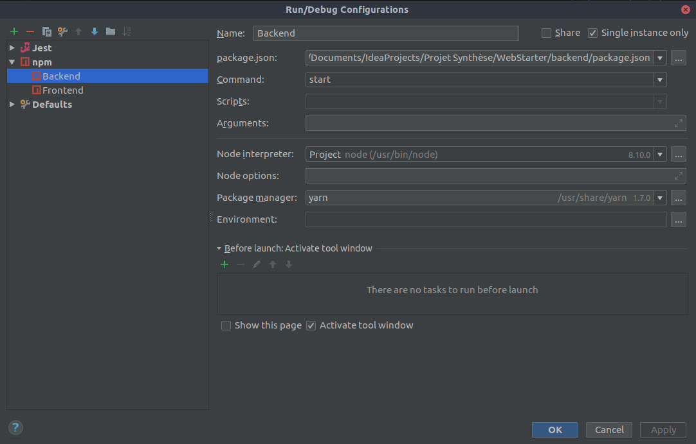

#### Déboguer le module ```backend```

Le module ```backend``` est déjà prêt à être débogué directement dans Intellij IDEA. Vous n'avez qu'à 
démarrer le module en mode ```Debug```.

Notez que cela est possible grâce à la variable d'environnement ```$NODE_DEBUG_OPTION```. Lorsque 
Intellij démarre une configuration ```npm ``` en mode ```Debug```, il envoie les paramètres 
nécessaires à ```NodeJs``` via cette variable d'environnement.

```json
{
  "scripts": {
    "start": "nodemon $NODE_DEBUG_OPTION src/index.js --watch src --exec babel-node"
  }
}
```

#### Déboguer le module ```frontend```

Il est fortement recommandé de déboguer ce module directement dans votre navigateur. Utilisez les 
outils de développement du navigateur (```CTRL-SHIFT-I```) pour y accéder.

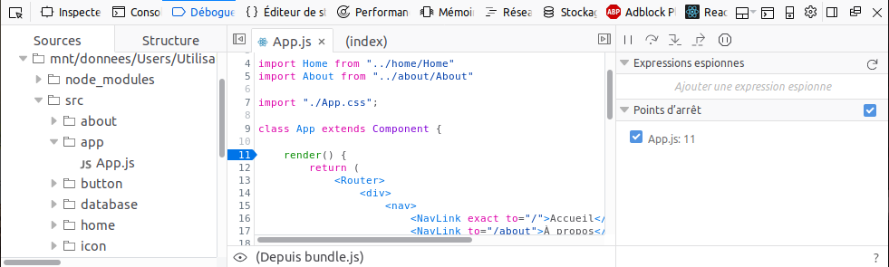

Pour une meilleure expérience, il est recommandé d'installer le plugin ```react``` dans votre 
navigateur. Consultez la section [Navigateur](README.MD#Navigateur) pour les détails.

#### Démarrer les tests unitaires

Les modules ```frontend``` et ```backend``` contiennent déjà tout ce dont vous avez besoin pour
écrire et exécuter des tests. Ils utilisent [Jest](http://jestjs.io/docs/en/using-matchers) et 
[Mocha](https://mochajs.org/#getting-started) comme ```test runner``` respectivement.

**IMPORTANT!!!** Le module ```frontend``` fut créé avec 
[create-react-app](https://github.com/facebook/create-react-app). Or, ```create-react-app``` ne 
[supporte que Jest 20.0.4](https://github.com/facebook/create-react-app/issues/4622). Vous devrez 
donc faire attention à utiliser l'api disponible pour les versions < 22 (disponible 
[ici](http://jestjs.io/docs/en/22.0/api)). 

Les deux modules utilisent [Chai](http://www.chaijs.com/api/bdd/) pour les assetions et 
[Sinon](http://sinonjs.org/releases/v6.0.1/stubs/) pour les Mocks.

**IMPORTANT** Le module ```frontend``` utilise parfois les [manual mocks](http://jestjs.io/docs/en/22.0/manual-mocks) à
la place de ```sinon```. En guise d'exemple, consultez ```TaskRepository.js``` et son mock dans le dossier 
```___mocks___```. Le module ```frontend``` utilise aussi [Enzyme](http://airbnb.io/enzyme/#shallow-rendering) pour 
faciliter les tests de composants ```React```.

Pour démarrer les tests d'un des des deux modules (```frontend``` ou ```backend```), créez des configurations de type 
```Jest``` et ```Mocha``` (respectivement) avec les paramètres suivants :

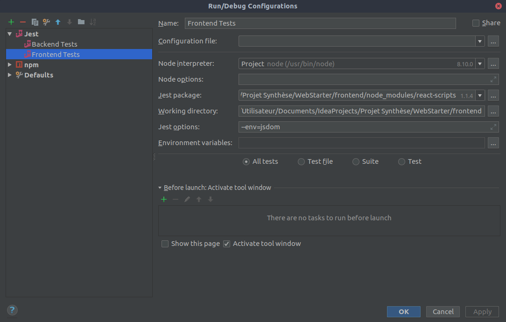

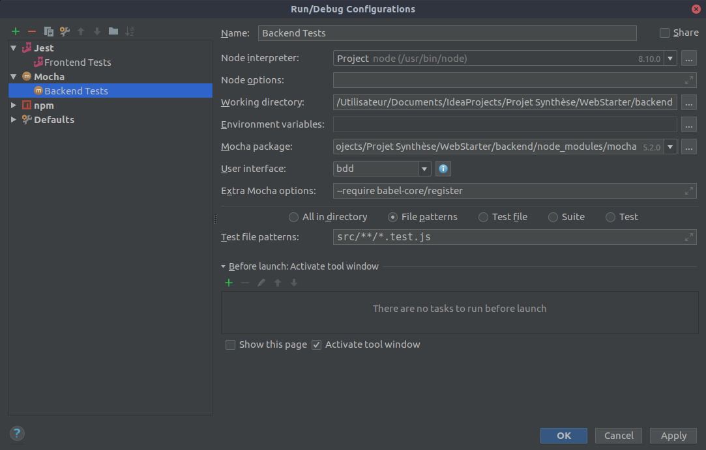

## Navigateur

Installez le plugin ```react``` dans votre navigateur. Cela vous permettra de consulter les ```props``` et le ```state``` 
de vos ```components```.

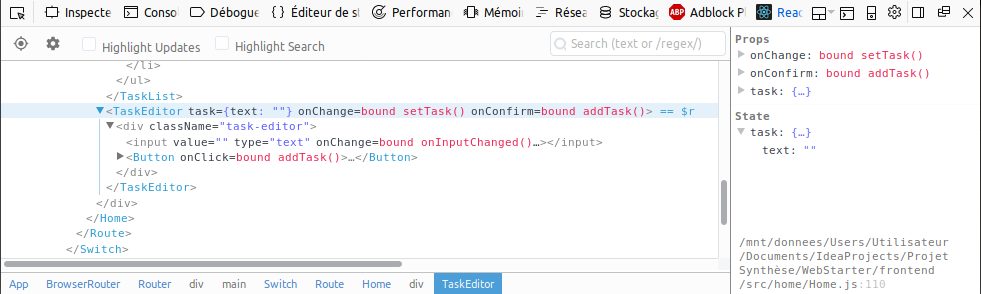

## Deploiement

Ce projet contient déjà tout ce dont vous avez besoin pour effectuer son déploiement sur Google Cloud. Par contre, il
faut configurer votre compte.

Notez que vous aurez besoin des rôles ```Compute Admin``` et ```Kubernetes Engine Admin``` sur votre projet 
```Google Cloud```. Demandez à votre professeur si vous ne les avez pas.

### Clé Google Cloud

Dans [GitLab](https://gitlab.com/), ouvrez votre projet et allez dans ```Settings -> CI / CD -> Variables```. Créez une
variable nommée ```GOOGLE_CLOUD_KEY```. La valeur de cette variable vous sera fournie par votre professeur, car elle
représente la clé d'accès au compte Google et doit donc rester secrète.

Dans [GitLab](https://gitlab.com/), ouvrez votre projet et allez dans ```Settings -> CI / CD -> Variables```. Créez une
variable nommée ```GOOGLE_CLOUD_KEY``` dont la valeur est le contenu du fichier que vous avez téléchargé.

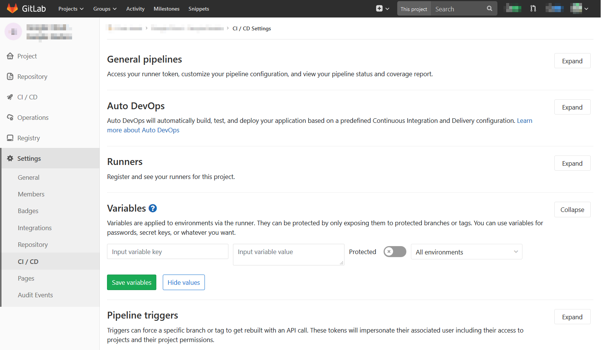

### Clé GitLab

Dans les paramêtres de votre compte [GitLab](https://gitlab.com/profile/personal_access_tokens), allez dans 
[Access Tokens](https://gitlab.com/profile/personal_access_tokens) et créez un token nommé ```GITLAB_REGISTRY``` avec
uniquement les droits ```read_registry```. Conservez précieusement la valeur de ce nouveau ```token```.

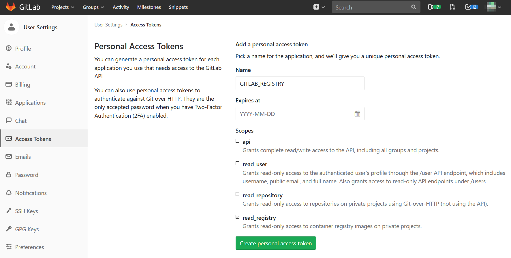

De retour dans votre projet, allez dans ```Settings -> CI / CD -> Variables``` et créez une variable nommée 
```GITLAB_REGISTRY_KEY``` dont la valeur est le token que vous venez de créer.

### Fichier ```.gitlab-ci.yml```

Ouvrez le fichier ```.gitlab-ci.yml```. Dans le haut du fichier, vous devriez trouver une section ```variables``` comme
ceci :

```yaml
variables:
  CI: "true" #Tell Jest to run tests in normal mode, not in watch mode.
  PROJECT_NAME: "mobile2-192601"
  CLUSTER_NAME: "psws-cluster"
  SERVER_NAME: "psws-server"
  SERVICE_NAME: "psws-service"
  STORAGE_NAME: "psws-storage"
  DOCKER_DRIVER: "overlay"
```

Personalisez la valeur des variables ```PROJECT_NAME```, ```CLUSTER_NAME```, ```SERVER_NAME```, ```SERVICE_NAME```,
```STORAGE_NAME```, ```psws-storage``` en ajoutant un préfix. *Faites attention à ce que leur longeur ne dépasse pas
15 caractères. Par exemple :

```yaml
variables:
  CI: "true" #Tell Jest to run tests in normal mode, not in watch mode.
  PROJECT_NAME: "mobile2-192601"
  CLUSTER_NAME: "pscl-eq-1"
  SERVER_NAME: "pssr-eq-1"
  SERVICE_NAME: "pssv-eq-1"
  STORAGE_NAME: "psst-eq-1"
  DOCKER_DRIVER: "overlay"
```

## Effecuter un déploiement

À chaque fois que vous ferez un ```push``` sur la branche ```master```, un déploiement sera délanché. Pour le consulter,
ouvrez votre projet dams [GitLab](https://gitlab.com/) et allez dans ```CI / CD -> Pipilines```. Vous devriez voir
un ```pipeline``` en cours d'exécution.

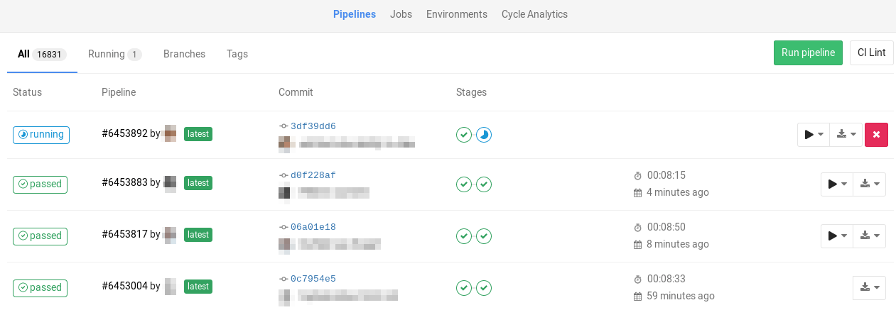

Vous pouvez voir où il en est plus précisément en cliquant sur ```Running```.

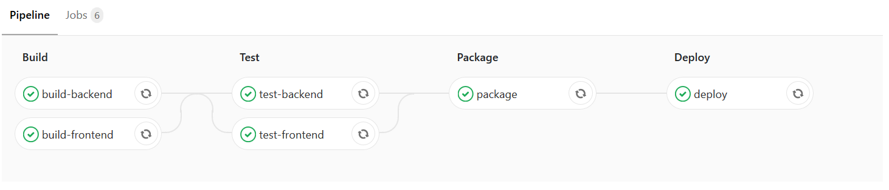

Vous pouvez ensuite voir le journal d'exécution complet en cliquant sur une des tâches tel
que ```build-backend```.

Par contre, même si votre ```pipeline``` se termine correctement, cela ne veut pas dire que votre application a démarré
correctement. Pour vérifier, dans [Google Cloud Console](https://console.cloud.google.com/), allez dans 
[Kubernetes Engine](https://console.cloud.google.com/kubernetes/) et ouvrez 
[Services](https://console.cloud.google.com/kubernetes/discovery). Vous devriez voir un ```Endpoint``` sur lequel vous
pourrez cliquer pour voir si votre application fonctionne.

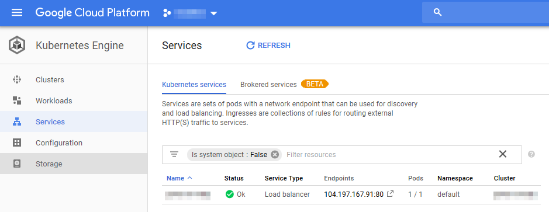

Vous pouvez aussi consulter les [Workloads](https://console.cloud.google.com/kubernetes/workload) pour avoir plus de 
détails, plus précisément dans l'onglet ```Events```.

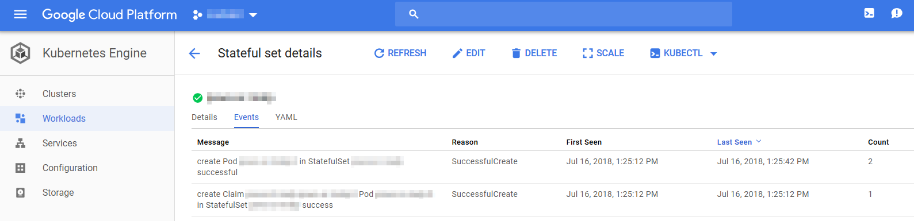

## Libraries et frameworks fournis

### Backend

* [Express](http://expressjs.com/) : Serveur Web.
* [Express-Session](https://github.com/expressjs/session) : Sessions web.
* [better-sqlite3](https://github.com/JoshuaWise/better-sqlite3/wiki/API) : Connecteur pour base de données SQLite.
* [Mocha](https://mochajs.org/) : Test Runner pour JavaScript.
* [Chai](http://www.chaijs.com/) : Assertion Library pour JavaScript.
* [Chai-Http](http://www.chaijs.com/plugins/chai-http/) : Assertion Library pour les serveurs HTTP.
* [Sinon](http://sinonjs.org/) : Mock Library pour JavaScript.

### Frontend

* [React](https://reactjs.org/docs/getting-started.html) : Interface utilisateur.
* [React-Router](https://reacttraining.com/react-router/web/guides/philosophy) : Router pour React 
  (choisir la page en fonction de l'URL).
* [Lodash](https://lodash.com/) : Librairie d'utilitaires JavaScript.
* [Jest](https://mochajs.org/) : Test Runner pour React.
* [Chai](http://www.chaijs.com/) : Assertion Library pour JavaScript.
* [Enzyme](https://airbnb.io/enzyme/) : Testing Library pour React.
* [Chai-Enzyme](https://github.com/producthunt/chai-enzyme) : Assertions Chai pour Enzyme.
* [Fetch-Mock](http://www.wheresrhys.co.uk/fetch-mock/) : Mock pour la fonction ```fetch```. Utilisé que pour la classe ```Database``` et **ne devrait
  pas être utilisé ailleurs**.
* [Sinon](http://sinonjs.org/) : Mock Library pour JavaScript. **Préférer les Mocks avec [Jest](https://jestjs.io/docs/en/22.0/getting-started.html).**
* [Sinon-Chai](http://sinonjs.org/) : Assertions Chai pour Sinon.
* [Sass](https://sass-lang.com/guide) : Prépropcesseur CSS.
* [Material Icons](https://material.io/tools/icons/) : Librarie d'icônes.

## Résolution de problèmes

### Cannot find module './Something.css' from 'Something.js'

Vous avez tenté d'exécuter les tests à partir de l'IDE sans avoir préalablement compilé
le projet. Exécutez ```yarn test``` dans les dossiers ```backend``` et ```frontend``` et
réessayez.